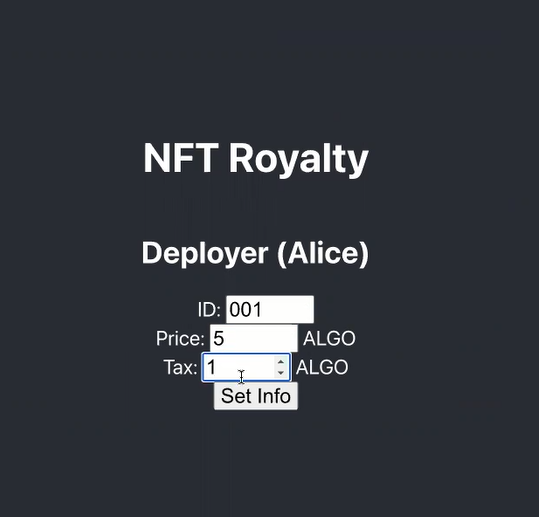
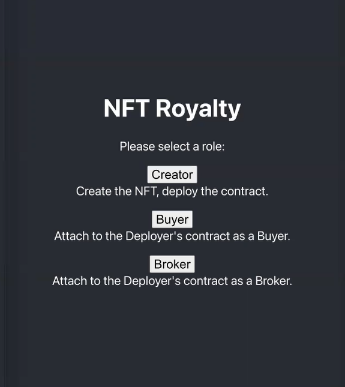
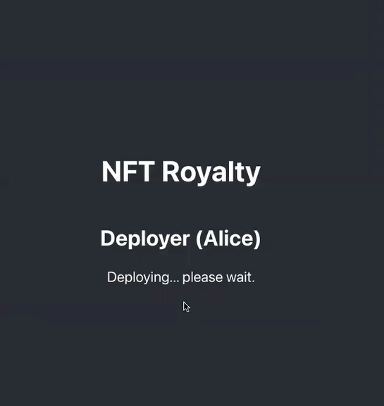
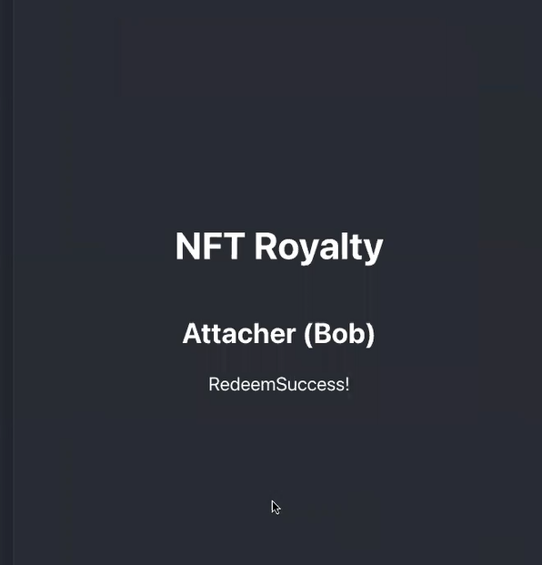
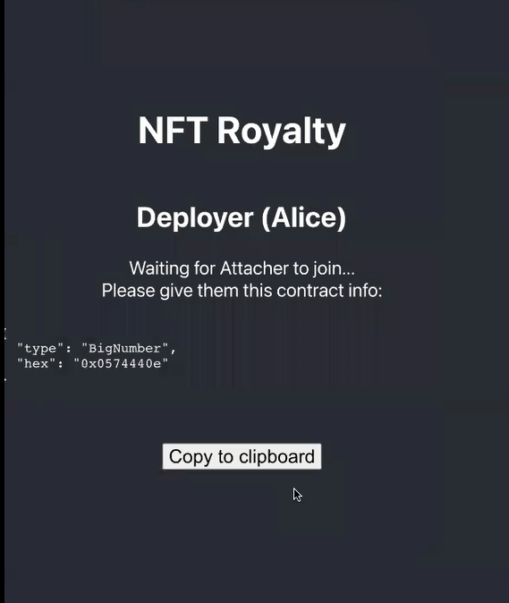
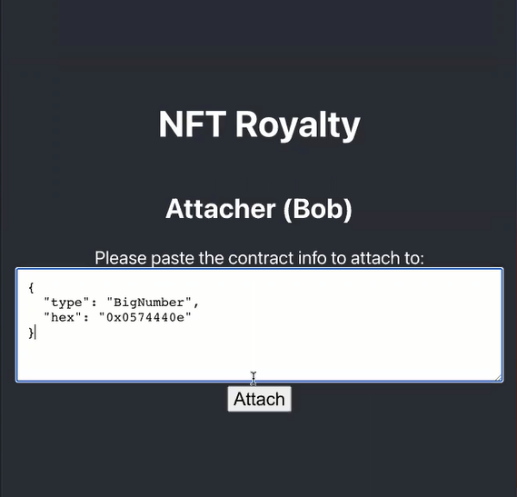
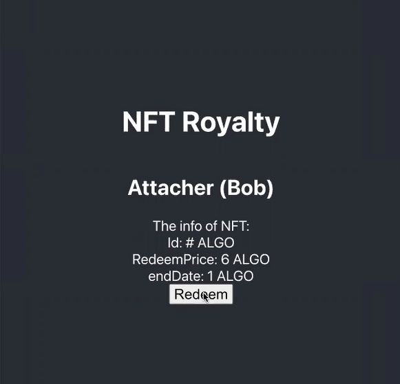

# {#nfr} NFT Royalty

NFT Royalty is a command-line and Web-based application that enables three participants (a `seller`, a `buyer` and a `broker`) to trade NFTs for royalty tokens via a Reach Decentralized Application (DApp). 
Reach programs are built using a Docker container on your computer.

NFT Royalty creates a payment plan that compensate creators, enabling the seller and buyer to make a transaction, and then exits.

This tutorial walks through the creation of a simple decentralized application.
This tutorial contains everything you need to know to build and test this application and assumes no prior experience with DApp/blockchain development of any kind. If you need help installing Reach and its prerequisites then get started at our [Quick Installation Guide](##nfr-2)
If you want a broad overview before diving in it, we recommend reading [the overview](##overview) first.

If you're ready, click through to the [first step](##nfr-2)!

# {#nfr-1} Learning Objectives

At the end of this tutorial you will be able to:

1. Install and Initialize
1. Scaffolding and Setup.
1. Build a Reach command-line DApp.
1. Convert the command-line DApp into a Web-app.

## {#nfr-2} Install and Initialize

Reach is designed to work on POSIX systems with [make](https://en.wikipedia.org/wiki/Make_(software)), [Docker](https://www.docker.com/get-started), and [Docker Compose](https://docs.docker.com/compose/install/) installed.
The best way to install Docker on Mac and Windows is with [Docker Desktop](https://www.docker.com/products/docker-desktop).

:::note
You probably already have `make` installed.
For example, OS X and many other POSIX systems come with `make`, but some versions of Linux do not include it by default and will require you to install it.
If you're on Ubuntu, you can run `sudo apt install make` to get it.
:::

You'll know that you have everything installed if you can run the following three commands without errors

```cmd
$ make --version
```

```cmd
$ docker --version
```

```cmd
$ docker-compose --version
```

:::note
If you're using Windows, consult [the guide to using Reach on Windows](##guide-windows).
:::

Once you've confirmed that they are installed, choose a directory for this project. We recommend

```cmd
$ mkdir -p ~/reach/nfte && cd ~/reach/nfte
```

Next, download Reach by running

```cmd
$ curl https://docs.reach.sh/reach -o reach ; chmod +x reach
```

You'll know that the download worked if you can run

```cmd
$ ./reach version
```

The recommended next step, although optional, is to set up your environment with

```cmd
$ ./reach config
```

This will make subsequent uses of the `reach` script more convenient by tuning its runtime behavior to your specific needs and only downloading the dependencies you'll actually use.

`{!cmd} reach config` sets overridable defaults for _all_ Reach projects on your development machine and not just the current one, so feel free to skip this step if you'd prefer not to make your choices global.

Since Reach is Dockerized, when you first use it, you'll need to download the images it uses.
Fetch them by running

```cmd
$ ./reach update
```

You'll know that everything is in order if you can run

```cmd
$ ./reach compile --help
```

---

:::note
Get language support for Reach in your editor by visiting @{seclink("guide-editor-support")}.
:::

Now that your Reach installation is in order, you should open a text editor and get ready to [write your first Reach application](##nfr-3)!


# {#nfr-3} Scaffolding and Setup

In this tutuorial, we'll be building a version of _NFT Royalty!_ where three participants, _Creator_, _Buyer_ and _Broker_, can wager on the result.
We'll start simple and slowly mmake the application more fully-featured.

You should follow along by copying each part of the program and seeing how things go.
If you're like us, you may find it beneficial to type each line out, rather than copying & pasting so you can start building your muscle memory and begin to get a sense for each part of a Reach program.

Let's start by creating a file nammed `index.rsh`.
It doesn't matter where you put this file, but we recommend putting it in the current directory, which would be `~/reach/nfr` if you're following along exactly.
In all the subsequent code samples, we'll label the files based on the chapter of the tutorial you're reading.
For example, start off by typing the following into `index.rsh`:

``` js
'reach 0.1';

export const main = Reach.App(() => {
  const A = Participant('Creator', {
    // Specify Creator's interact interface here
  });
  const B = Participant('Buyer', {
    // Specify Buyer's interact interface here
  });
  const C = Participant('Broker', {
    // Specify Broker's interact interface here
  });
  init();
   // write your program here
   
 });
  ```

:::note
Did you notice the attractive copy icon on the top the right of that box?
You can click on it and the content of the code box will be copied onto your clipboard.
:::

:::note
Did your text editor recognize `index.rsh` as a Reach program and give you proper syntax highlighting?
If not, check if there's a plugin available for your editor by visiting @{seclink("guide-editor-support")} or manually
configure it to treat Reach (`.rsh`) files as JavaScript and things will be mostly correct.
:::

This is just a shell of a program that doesn't do much, but it has a few important components.

+ Line 1 indicates that this is a Reach program.
You'll always have this at the top of every program.
+ Line 3 defines the main export from the program.
When you compile, this is what the compiler will look at.
+ Lines 4 through 12 specify the three participants to this application, _Creator_, _Buyer_, and _Broker_.
+ Line 15 marks the deployment of the the Reach program, which allows the program to start doing things.

Before we go too much further, let's create a similar shell for our JavaScript frontend code.
Open a new file named `index.mjs` and fill it with this:

``` js
import { loadStdlib } from '@reach-sh/stdlib';
import * as backend from './build/index.main.mjs';
const stdlib = loadStdlib();

const startingBalance = stdlib.parseCurrency(100);
const accCreator = await stdlib.newTestAccount(startingBalance);
const accBuyer = await stdlib.newTestAccount(startingBalance);
const accBroker = await stdlib.newTestAccount(startingBalance);

const ctcCreator = accCreator.contract(backend);
const ctcBuyer = accBuyer.contract(backend, ctcCreator.getInfo());
const ctcBroker = accBroker.contract(backend, ctcCreator.getInfo());

await Promise.all([
  ctcCreator.p.Creator({
    // implement Creator's interact object here
  }),
  ctcBuyer.p.Buyer({
    // implement Buyer's interact object here
  }),
  ctcBroker.p.Broker({
    // implement Broker's interact object here
]);
```
  
This JavaScript code is similarly schematic and will be consistent across all of your test programs.

+ Line 1 imports the Reach standard library loader.
+ Line 2 imports your backend, which `./reach compile` will produce.
+ Line 3 loads the standard library dynamically based on the `REACH_CONNECTOR_MODE` environment variable.
+ Line 5 defines a quantity of network tokens as the starting balance for each test account.
+ Lines 6, 7 and 8 create test accounts with initial endowments for Creator, Buyer and Broker.
This will only work on the Reach-provided developer testing network.
+ Line 10 has Creator deploy the application.

+ Line 11 has Buyer attach to it.
+ Line 12 has Broker attach to it.
+ Lines 16 through 18 initialize a backend for Alice.
+ Lines 19 through 21 initialize a backend for Bob.
+ Line 22 waits for the backends to complete.

This is now enough for Reach to compile and run our program. Let's try by running

```cmd
$ ./reach run
```

Reach should now build and launch a Docker container for this application.
Since the application doesn't do anything, you'll just see a lot of diagnostic messages though, so that's not very exciting.

:::note
The entire process that we just went through can be automated by running
```cmd
$ ./reach init
```
 when you start your next project!
:::

In [the next step](##tut-4), we'll implement the logic of _NFT Royalty!_ and our application will start doing something!

::::testQ
When you write a DApp using Reach, do you
1. write a smart contract in Solidity, a backend in JavaScript using the Ethereum SDK, and a frontend in JavaScript, then use Reach to test and deploy it;
1. write a program in Reach that generates a smart contract & a backend and a front-end in JavaScript, then use Reach to test and deploy it?

:::testA
2; Reach abstracts away the details of the underlying consensus network
:::

::::

## {#tut-4} NFT Royalty

In this section, we'll have the Creator, the Buyer and the Broker actually implement the _NFT Royalty!_.

We have to decide how to represent the hands of the game.
A simple way is to represent them as the numbers `{!rsh} 0`, `{!rsh} 1`, and `{!rsh} 2`, standing for `Rock`, `Paper`, and `Scissors`.
However, Reach does not support unsigned integers of exactly two bits, so it is better to represent them as the equivalence class of integers modulo three, so we won't distinguish between `{!rsh} 0` and `{!rsh} 3` as `Rock`.

We'll use a similar strategy for representing the three outcomes of the game: `B wins`, `Draw`, and `A wins`.

The first step is to change the Reach program to specify that Alice and Bob's frontends can be interacted with to get the move that they will play, and later informed of the outcome of the game.

```
load: /examples/rps-2-rps/index.rsh
md5: 3ea7718e88c86dd41e97b503d7aa3b67
range: 1-17
```

+ Lines 3 through 6 define a participant interact interface that will be shared between the two players.
In this case, it provides two methods: `{!rsh} getHand`, which returns a number; and `{!rsh} seeOutcome`, which receives a number.
+ Lines 9 through 14 use this interface for both participants.
Because of this line, `{!rsh} interact` in the rest of the program will be bound to an object with methods corresponding to these actions, which will connect to the frontend of the corresponding participant.

Before continuing with the Reach application, let's move over to the JavaScript interface and implement these methods in our frontend.


Reach programs (the `index.rsh` portion of your Reach DApp) are organized into four modes: `Init Mode`, `Step Mode`, `Local 
Step Mode`, and `Consensus Step Mode`.

### {#nfr-4} Init Mode

Application Initialization defines participants and views.

Lines 2, 3 and 4 below occur in the App Init section of the program:

``` js
'reach 0.1';

export const main = Reach.App(() => {
  const A = Participant('A', {
    ...Creator,
    id: UInt, // id of NFT
    price: UInt, // price
    tax: UInt, // tax
  });
  const B   = Participant('B', {
    ...Buyer
  });
  const C   = Participant('C', {
    ...Broker
  });
  deploy();
  ```
  
The `{!rsh} init` function transitions the program from `App Init` to `Step`.

### {#nfr-5} Step Mode
A `Step` specifies actions taken by each and every participant. 
`exit()`, for example, is a function that must occur within a step, and it means that each and every participant exits 
the contract after which that instance of the contract becomes forever unavailable.

### {#nfr-6} Local Step Mode
A `Local Step` specifies actions taken by a single participant. 
Local steps must occur within the body of `{!rsh} only` or `{!rsh} each` statements. 
Here is an example:

``` js
A.only(() => {
    const id = declassify(interact.getId());
    const price = declassify(interact.getPrice());
    const tax = declassify(interact.getTax());
  });
  ```
  
`{!rsh} only()` and `{!rsh} each()` transition to a local step and then back to the originating mode (either `Step` or 
`Consensus Step`).

### {#nfr-7} Consensus Step Mode

A `Consensus Step` specifies actions taken by the contract itself. 
Later in this tutorial, the contract calls `{!rsh} transfer` to transfer funds from the contract to the `seller`.

# {#nfr-8} Pre-coding preparation

Before you start to code, it is a good idea to think about the application that you want to create and write down a plan 
for the actions. 
This makes it easier to code the app, add in all of the functionality, and be less likely to make a mistake.

NFT with Royalty requirements:

1. NFT with Royalty requires three participants, a `Buyer`, a `Broker` and a `Seller`.
1. The `buyer` will need a pay function and a function that displays the purchased NFT.
1. The `broker` will need a function to hold the price and the NFT to be released to both seller and buyer.
1. The `seller` will need a function to input the NFT, and to put it up for sale.
1. Participants will be publishing information: the seller will publish the NFT and the price, the buyer will publish their decision to purchase, and the broker will release the NFT to the buyer and the price to the seller.
1. The `buyer` needs to be able to decide to NOT purchase the NFT, so we need to create a function for cancelling the sale.
1. If the `buyer` does decide to buy the wisdom, then there needs to be a function that reports the payment to both the 
`seller` and the `buyer`.

# {#nfr-9} Examine the transaction

This particular transaction took place on an Algorand devnet. 
The Algorand cryptocurrency standard token unit is the `ALGO`. 
These expenses represent `fees`, the cost of doing business on a consensus network. 
The `seller` paid a little more fees than the `buyer` because the `seller` paid a small fee to deploy the contract.

# {#nfr-10} Create the files
Create a project folder and `{!cmd} cd` into it via the command line.

```cmd
$ mkdir -p ~/reach/nfte && cd ~/reach/nfte
```

Create `index.js` and `index.rsh` in your project folder and open both new files in your preferred editor.


## {#wfs-11} Create the Frontend

Type the following code into the file named `index.js`.

``` js
load: /examples/wisdom-1-starter/index.js
md5: 77f7503ee58c2459f3793262212ca702
range: 1-8
```

Line 1: 


## {#nfr-9} Web Interaction

In the last section, we made _NFT Royalty!_ run as a command-line application, without any changes to the Reach program.
In this section, we again won't be making any changes to the Reach program.
Instead, we'll replace the command-line interface with a Web interface.

We will use [React.js](https://reactjs.org/) for this tutorial, but the same principles apply to any Web framework.

:::note
If you've never used React before, here are some basics about how it works:
+ React programs are JavaScript programs that use a special library that allows you to mix HTML inside of the body of your JavaScript.
+ React has a special compiler that combines a bundle of JavaScript programs, and all their dependencies, into one large file that can be deployed on a static Web server.
This is called "packing".
+ When you're developing and testing with React, you run a special development Web server that watches and updates this packed file every time you modify a source file, so you don't have to constantly run the compiler.
+ Reach automates the process of starting this development server for you when you run `./reach react` and gives you access to it at `http://localhost:3000/`.

:::

Similarly, in this tutorial, we assume that we will be deploying (and testing) with Ethereum.
Reach Web applications rely on the Web browser to provide access to a consensus network account and its associated wallet.
On Ethereum, the standard wallet is [MetaMask](https://metamask.io).
If you want to test this code, you'll need to install it and set it up.
Furthermore, MetaMask does not support multiple active accounts, so if you want to test _NFT Royalty!_ locally, you'll need to have three separate browser instances: one to act as the Creator, the other as the Buyer, and another to act as the Broker.

To complete this section we'll use the `index.rsh` you've already written and create an `index.js` file from scratch which replaces `index.mjs`.

:::note
If you do not replace `index.mjs`, then you will get an error when you run `reach react`.
You can avoid this error by renaming the file to `index.mjs.bak`, or by creating a totally new directory with a copy of the old `index.rsh.`
We do the second option.
:::

This code is also supplemented with [index.css](https://github.com/gudnexgudy/NFT-Royalties/blob/main/index.css) and some [views](https://github.com/gudnexgudy/NFT-Royalties/tree/main/views).
These details are not specific to Reach, and are fairly trivial, so we will not explain the specifics of those files. If you run this locally, you'll want to download those files.
Your directory should look like:

```
.
├── index.css
├── index.js
├── index.rsh
└── views
    ├── AppViews.js
    ├── CreatorViews.js
    ├── BuyerViews.js
    ├── BrokerViews.js
    └── render.js
```

---

We will focus on [`index.js`](https://github.com/gudnexgudy/NFT-Royalties/blob/main/index.js), because [`index.rsh`](https://github.com/gudnexgudy/NFT-Royalties/blob/main/index.rsh) is the same as previous sections.

``` js
import React from 'react';
import AppViews from './views/AppViews';
import CreatorViews from './views/CreatorViews';
import BuyerViews from './views/BuyerViews';
import BrokerViews from './views/BrokerViews';
import {renderDOM, renderView} from './views/render';
import './index.css';
import * as backend from './build/index.main.mjs';
import {loadStdlib} from '@reach-sh/stdlib';
const reach = loadStdlib('ALGO');
import { ALGO_MyAlgoConnect as MyAlgoConnect } from '@reach-sh/stdlib';
```

On lines 1 thru 7, we import our view code and CSS.
On line 8, we import the compiled `{!rsh} backend`.
On lines 9 and 10, we load the `{!rsh} stdlib` as `{!rsh} reach`.

React compiles the Reach standard library in such a way that it does not have direct access to the environment variables which are used to select the desired standard library.
This is why you need to pass `{!js} process.env` as an argument to achieve the desired effect.

``` js

reach.setWalletFallback(reach.walletFallback({providerEnv: 'TestNet', MyAlgoConnect }));
const {standardUnit} = reach;
const defaults = {defaultFundAmt: '10', defaultWager: '3', standardUnit};
```

On these lines we define a few helpful constants and defaults for later,
some corresponding to the enumerations we defined in Reach.

### {#nfr-9-App} Application component

We start defining the main application view, `{!js} App`, as a React component,
and tell it what to do once it mounts, which is the React term for starting.

``` js

class App extends React.Component {
  constructor(props) {
    super(props);
    this.state = {view: 'ConnectAccount', ...defaults};
  }
  
  async componentDidMount() {
    const now = await reach.getNetworkTime();
    reach.setQueryLowerBound(reach.sub(now, 3000));

    const acc = await reach.getDefaultAccount();
    const balAtomic = await reach.balanceOf(acc);
    const bal = reach.formatCurrency(balAtomic, 4);
    this.setState({acc, bal});
    if (await reach.canFundFromFaucet()) {
      this.setState({view: 'FundAccount'});
    } else {
      this.setState({view: 'DeployerOrAttacher'});
    }
  }
```

``` js
  render() { return renderView(this, AppViews); }
}
```

+ On line 20, we initialize the component state to display @{seclink("nfr-9-ConnectAccount")}.
+ On lines 22 thru 32, we hook into [React's `{!js} componentDidMount` lifecycle event](https://reactjs.org/docs/react-component.html#componentdidmount), which is called when the component starts.
+ On line 23, we use `{!js} getDefaultAccount`, which accesses the default browser account.
For example, when used with Ethereum, it can discover the currently-selected MetaMask account.
+ On line 27, we use `{!js} canFundFromFaucet` to see if we can access the Reach developer testing network faucet.
+ On line 28, if `{!js} canFundFromFaucet` was `{!js} true`, we set the component state to display @{seclink("tut-9-FundAccount")}.
+ On line 30, if `{!js} canFundFromFaucet` was `{!js} false`, we set the component state to skip to @{seclink("tut-9-DeployerOrAttacher")}.
+ On line 41, we render the appropriate view from [nft-royalties/views/AppViews.js](https://github.com/gudnexgudy/NFT-Royalties/blob/main/views/AppViews.js).

### {#nfr-9-ConnectAccount} Connect Account dialog

When we combine the application component with the view ([nft-royalties/views/AppViews.js](https://github.com/gudnexgudy/NFT-Royalties/blob/main/views/AppViews.js)) it will look like:


### {#nfr-9-FundAccount} Fund Account dialog

Next, we define callbacks on `{!js} App` for what to do when the user clicks certain buttons.

``` js
  async fundAccount(fundAmount) {
    await reach.fundFromFaucet(this.state.acc, reach.parseCurrency(fundAmount));
    this.setState({view: 'DeployerOrAttacher'});
  }
  async skipFundAccount() { this.setState({view: 'DeployerOrAttacher'}); }
```

+ On lines 33 thru 36, we define what happens when the user clicks the `Fund Account` button.
+ On line 34, we transfer funds from the faucet to the user's account.
+ On line 35, we set the component state to display @{seclink("nfr-9-DeployerOrAttacher")}.
+ On line 37, we define what to do when the user clicks the `Skip` button,
which is to set the component state to display @{seclink("nfr-9-DeployerOrAttacher")}.

When we combine this with the view ([nft-royalties/views/AppViews.js](https://github.com/gudnexgudy/NFT-Royalties/blob/main/views/AppViews.js)) it will look like:


### {#nfr-9-DeployerOrAttacher} Choose Role

``` js
selectCreator() { this.setState({view: 'Wrapper', ContentView: Creator}); }
  selectBuyer() { this.setState({view: 'Wrapper', ContentView: Buyer}); }
  selectBroker() { this.setState({view: 'Wrapper', ContentView: Broker}); }
```

On lines 38, 39 and 40, we set a sub-component based on whether the user clicks `Creator`, `Buyer` or `Broker`.

When we combine this with the view ([nft-royalties/views/AppViews.js](https://github.com/gudnexgudy/NFT-Royalties/blob/main/views/AppViews.js)) it will look like:


### {#nfr-9-Creator} Creator component

Next, we will define `{!js} Creator` as a React component, that will hold all of the behavior of the specialized components for Creator, Buyer and Broker.

Our Web frontend needs to implement the participant interact interface for creators, which we defined as:

``` js
const Creator = {
  getId: Fun([], UInt), 
  getPrice: Fun([], UInt), 
  getTax: Fun([], UInt)
};
```

We will provide these callbacks via the React component directly.

``` js
class Creator extends React.Component {
  constructor(props) {
    super(props);
    this.state = {view: 'SetInfo'};
  }
  setInfo(id, price, tax) { this.setState({view: 'Deploy', id, price, tax}); }
  getId() {return this.state.id;}
  getPrice() {return this.state.price;}
  getTax() {return this.state.tax;}

  async deploy() {
    const ctc = this.props.acc.deploy(backend);
    this.setState({view: 'Deploying', ctc});
    this.id = reach.parseCurrency(this.state.id); // UInt
    this.price = reach.parseCurrency(this.state.price); // UInt
    this.tax = reach.parseCurrency(this.state.tax); // UInt
    backend.A(ctc, this);
    const ctcInfoStr = JSON.stringify(await ctc.getInfo(), null, 2);
    this.setState({view: 'WaitingForAttacher', ctcInfoStr});
  }
  render() { return renderView(this, CreatorViews); }
}
```

+ On line 65, we provide the `{!js} setInfo` callback
+ On line 66, we provide the `{!js} getId` callback
+ On line 67, we provide the `{!js} getPrice` callback
+ On line 68, we provide the `{!js} getTax` callback
+ On lines 70 thru 79, we provide the `{!js} deploy` callback.
+ On line 76, which occurs after the `{!js} Promise` is resolved, we set the component state to display @{seclink("nfr-9-WaitingForAttacher")}.

### {#nfr-9-GetHand} Deploy dialog

The dialog used to get a hand from the player ([nft-royalties/views/AppViews.js](https://github.com/gudnexgudy/NFT-Royalties/blob/main/views/AppViews.js)) looks like:


### {#tut-9-WaitingForResults} Waiting for results display

The dialog used to get a hand from the player ([nft-royalties/views/AppViews.js](https://github.com/gudnexgudy/NFT-Royalties/blob/main/views/AppViews.js)) looks like:


### {#tut-9-Done} Done display

The display when the player sees the end of the game ([nft-royalties/views/AppViews.js](https://github.com/gudnexgudy/NFT-Royalties/blob/main/views/AppViews.js)) looks like:


### {#tut-9-Deployer} Deployer component

Next, we will define `{!js} Deployer` as a React component for A, which extends `{!js} Creator`.

Our Web frontend needs to implement the participant interact interface for A, which we defined as:

``` js
const A = Participant('A', {
    ...Creator,
    id: UInt, // id of NFT
    price: UInt, // price
    tax: UInt, // tax
  });
```

We will provide the `{!js} id`, `{!js} price`, and `{!js} tax` values, and define some button handlers in order to trigger the deployment of the contract.

``` js
class Creator extends React.Component {
  constructor(props) {
    super(props);
    this.state = {view: 'SetInfo'};
  }
  setInfo(id, price, tax) { this.setState({view: 'Deploy', id, price, tax}); }
  getId() {return this.state.id;}
  getPrice() {return this.state.price;}
  getTax() {return this.state.tax;}

  async deploy() {
    const ctc = this.props.acc.deploy(backend);
    this.setState({view: 'Deploying', ctc});
    this.id = reach.parseCurrency(this.state.id); // UInt
    this.price = reach.parseCurrency(this.state.price); // UInt
    this.tax = reach.parseCurrency(this.state.tax); // UInt
    backend.A(ctc, this);
    const ctcInfoStr = JSON.stringify(await ctc.getInfo(), null, 2);
    this.setState({view: 'WaitingForAttacher', ctcInfoStr});
  }
  render() { return renderView(this, CreatorViews); }
}
```

+ On line 59, we set the component state to display @{seclink("tut-9-SetInfo")}.
+ On line 61, we define what to do when the user clicks the `Set Info` button,
which is to set the component state to display @{seclink("tut-9-Deploy")}.
+ On lines 62 thru 69, we define what to do when the user clicks the `Deploy` button.
+ On line 63, we call `{!js} acc.deploy`, which triggers a deploy of the contract.
+ On line 64, we set the component state to display @{seclink("tut-9-Deploying")}.
+ On line 65, we set the `{!js} id` property.
+ On line 66, we set the `{!js} price` property.
+ On line 67, we set the `{!js} tax` property based on which connector is being used.
+ On line 68, we start running the Reach program as A, using the `{!js} this` React component
as the participant interact interface object.
+ On lines 69 and 70, we set the component state to display @{seclink("tut-9-WaitingForAttacher")},
which displays the deployed contract info as JSON.
+ On line 72, we render the appropriate view from [nft-royalties/views/DeployerViews.js](https://github.com/gudnexgudy/NFT-Royalties/blob/main/views/DeployerViews.js).

### {#tut-9-SetWager} Set Info dialog

The dialog used to set the wager ([nft-royalties/views/DeployerViews.js](https://github.com/gudnexgudy/NFT-Royalties/blob/main/views/DeployerViews.js)) looks like:


### {#tut-9-Deploy} Deploy dialog

The dialog used to deploy ([nft-royalties/views/DeployerViews.js](https://github.com/gudnexgudy/NFT-Royalties/blob/main/views/DeployerViews.js)) looks like:


### {#tut-9-Deploying} Deploying display

The display shown while deploying ([nft-royalties/views/DeployerViews.js](https://github.com/gudnexgudy/NFT-Royalties/blob/main/views/DeployerViews.js)) looks like:


### {#tut-9-WaitingForAttacher} Waiting for Attacher display

The display shown while waiting for the attacher ([nft-royalties/views/DeployerViews.js](https://github.com/gudnexgudy/NFT-Royalties/blob/main/views/DeployerViews.js)) looks like:


### {#tut-9-Attacher} Buyer component

Our Web frontend needs to implement the participant interact interface for B, which we defined as:

``` js
const B   = Participant('B', {
    ...Buyer
  });
```

We will provide the `{!js} buyer` callback, and define some button handlers in order to attach to the deployed contract.

``` js
class Buyer extends React.Component {
  constructor(props) {
    super(props);
    this.state = {view: 'Attach'};
  }

  attach(ctcInfoStr) {
    const ctc = this.props.acc.attach(backend, JSON.parse(ctcInfoStr));
    this.setState({view: 'Attaching'});
    backend.B(ctc, this);
  }

  async buy(idAtomic, priceAtomic) {
    console.log(idAtomic, priceAtomic);
    const id = idAtomic.toNumber();
    const price = priceAtomic.toNumber();
    console.log(id, price);
    return await new Promise(bought => {
      this.setState({view: 'BuyNFT', id, price, standardUnit, bought});
    });
  }
```

+ On line 86, we initialize the component state to display @{seclink("tut-9-Attach")}.
+ On lines 88 thru 92, we define what happens when the user clicks the `Attach` button.
+ On line 89, we call `{!js} acc.attach`
+ On line 90, we set the component state to display @{seclink("tut-9-Attaching")}.
+ On line 91, we start running the Reach program as Bob, using the `{!js} this` React component
as the participant interact interface object.
+ On lines 93 thru 98, we define the `{!js} acceptWager` callback.
+ On lines 95 thru 97, we set the component state to display @{seclink("tut-9-BuyNFT")}, and wait for a `{!js} Promise` which can be resolved via user interaction.
+ On lines 99 thru 102, we define what happens when the user clicks the `Accept Terms and Buy NFT` button:
the `{!js} Promise` from line 100 is resolved, and we set the component state to display @{seclink("tut-9-WaitingForTurn")}.
+ On line 103, we render the appropriate view from [nft-royalties/views/AttacherViews.js](https://github.com/gudnexgudy/NFT-Royalties/blob/main/views/AttachererViews.js)

### {#tut-9-Attach} Attach dialog

The dialog used to attach ([nft-royalties/views/AttacherViews.js](https://github.com/gudnexgudy/NFT-Royalties/blob/main/views/AttachererViews.js)) looks like:


### {#tut-9-Attaching} Attaching display

The display when attaching ([nft-royalties/views/AttacherViews.js](https://github.com/gudnexgudy/NFT-Royalties/blob/main/views/AttachererViews.js)) looks like:


### {#tut-9-AcceptTerms} Buy NFT dialog

The dialog used to accept the terms of the wager ([nft-royalties/views/AttacherViews.js](https://github.com/gudnexgudy/NFT-Royalties/blob/main/views/AttachererViews.js)) looks like:


### {#tut-9-WaitingForTurn} Waiting for Turn display

The display when waiting for a turn ([nft-royalties/views/AttacherViews.js](https://github.com/gudnexgudy/NFT-Royalties/blob/main/views/AttachererViews.js)) looks like:


### {#tut-9-Final} Putting it all together

```
load: /NFT-Royalties/blob/main/index.js
md5: 29b1b17df91e1d49053670f72eebc6b4
range: 174-174
```

---
As a convenience for running the React development server,
you can call:

```cmd
$ ./reach react
```

:::note
If you get an error or it does not seem to be working correctly, make sure that the folder does not have an `index.mjs` file.
If you do, you can rename it to `index.mjs.bak` or move it to a new directory with a copy of the old `index.rsh`.
:::

---

To run the React development server with Algorand,
you can call:

```cmd
$ REACH_CONNECTOR_MODE=ALGO ./reach react
```

:::note
If you expect that your Algorand users do not have access to an [ARC-0011](https://github.com/algorandfoundation/ARCs/blob/main/ARCs/arc-0011.md) browser wallet, you want to provide a fallback.

If you add the following to your program, then you can provide a simple wallet where the user copies and pastes their mnemonic for each interaction.
```js
reach.setWalletFallback(reach.walletFallback({}));
```

Instead, if you would like to allow your users to use [MyAlgo](https://wallet.myalgo.com/home), then you can add the following:
```js
import { ALGO_MyAlgoConnect as MyAlgoConnect } from '@reach-sh/stdlib';
reach.setWalletFallback(reach.walletFallback({
  providerEnv: 'TestNet', MyAlgoConnect }));
```

Or, you could have your users use [WalletConnect](https://walletconnect.com/) to connect to the [Algorand Wallet](https://algorandwallet.com/), by adding the following:
```js
import { ALGO_WalletConnect as WalletConnect } from '@reach-sh/stdlib';
reach.setWalletFallback(reach.walletFallback({
  providerEnv: 'TestNet', WalletConnect }));
```

(Of course, you may want to replace `'TestNet'` in either of these samples with a different network name, like `'MainNet'`.)

Because these are fallbacks, you need to decide for your users which wallet they'll use, or make a user interface element to let them select which wallet fallback to use.

:::

Similarly, to run with Conflux:

```cmd
$ REACH_CONNECTOR_MODE=CFX ./reach react
```

:::note
To adapt this example for Conflux TestNet or MainNet,
you can add this after the imports:

```js
reach.setProviderByName('TestNet'); // or 'MainNet'
```

For details, see [the Conflux FAQ](##cfx-faq-mainnet).
:::

---
If you'd like to instead use Reach in your own JavaScript project,
you can call:

```cmd
$ npm install @reach-sh/stdlib
```

:::note
The Reach standard library is undergoing continual improvement and is updated often.
If you are experiencing issues with the Node.js package, try updating!
:::

As usual, you can compile your Reach program `index.rsh` to the `{!js} backend` build artifact `build/index.main.mjs` with:

```cmd
$ ./reach compile
```

---
Now our implementation of _Rock, Paper, Scissors!_ is live in the browser!
We can leverage callbacks in the participant interact interface to display to and gather information from the user,
through any Web UI framework of our choice.

If we wanted to deploy this application to the world, then we would take the static files that React produces and host them on a Web server.
These files embed your compiled Reach program, so there's nothing more to do than provide them to the world.

In [the next section](##tut-10), we'll summarize where we've gone and direct you to the next step of your journey to decentralized application mastery.

::::testQ
Reach integrates with all Web interface libraries, like React, Vue, and so on, because Reach frontends are just normal JavaScript programs.
:::testA
True
:::

::::

::::testQ
Reach accelerates your development with React by baking-in a React development server and the deployment process to test React programs locally.
:::testA
True
:::

::::

How difficult was all this?
Let's look at the final versions of our programs.

First, let's look at the Reach program:

``` js
'reach 0.1';
'use strict';

// Create NFT, set ID, price, and tax
const Creator = {
  getId: Fun([], UInt), 
  getPrice: Fun([], UInt), 
  getTax: Fun([], UInt)
};

// Buy NFT, total cost
const Buyer = {
  buy: Fun([UInt, UInt], Null),
  pawn: Fun([], Null),
  redeem: Fun([UInt, UInt, UInt], Null),
  getPawnPrice: Fun([], UInt),
  getRedeemPrice: Fun([], UInt),
  getDuration: Fun([], UInt),
  getRedeemCost: Fun([], UInt),
  getCurrentDate: Fun([], UInt),
  getEndDate: Fun([], UInt)
};

// Accept pawn, the day of accept, the total fee to pay
const Broker = {
  accept: Fun([UInt, UInt, UInt, UInt], Null)
};

// const NFT = {owner: Address, id: UInt, price: UInt, tax: UInt};

export const main = Reach.App(() => {
  const A = Participant('A', {
    ...Creator,
    id: UInt, // id of NFT
    price: UInt, // price
    tax: UInt, // tax
  });
  const B   = Participant('B', {
    ...Buyer
  });
  const C   = Participant('C', {
    ...Broker
  });
  init();
  
  // create new nft, own by A
  A.only(() => {
    const id = declassify(interact.getId());
    const price = declassify(interact.getPrice());
    const tax = declassify(interact.getTax());
  });
  A.publish(id, price, tax);
  commit();

  // B buy the nft
  B.only(() => {
    interact.buy(id, price);
  });
  B.pay(price);
  transfer(price).to(A);
  commit();

  // B pawn the nft
  B.only(() => {
    interact.pawn();
    const pawnPrice = declassify(interact.getPawnPrice());
    const redeemPrice = declassify(interact.getRedeemPrice());
    const endDate = declassify(interact.getEndDate());
  });
  B.publish(pawnPrice, redeemPrice, endDate);
  commit();

  // C accept pawn, pay to A and B
  C.only(()=> {
    interact.accept(id, pawnPrice, redeemPrice, endDate);
  });

  C.pay(pawnPrice);
  const res2 = pawnPrice - tax;
  transfer(tax).to(A);
  transfer(res2).to(B);
  commit();

  // B try to redeem NFT
  B.only(() => {
    const currentDate = declassify(interact.getCurrentDate());
    interact.redeem(id, redeemPrice, endDate);
  });
  B.publish(currentDate);
  if (endDate >= currentDate) {
    const res3 = redeemPrice - tax;
    commit();

    B.pay(redeemPrice);
    transfer(tax).to(A);
    transfer(res3).to(C);
  }
  commit();
});
```

And finally, the Web frontend:

``` js
import React from 'react';
import AppViews from './views/AppViews';
import CreatorViews from './views/CreatorViews';
import BuyerViews from './views/BuyerViews';
import BrokerViews from './views/BrokerViews';
import {renderDOM, renderView} from './views/render';
import './index.css';
import {loadStdlib} from '@reach-sh/stdlib';
import * as backend from './build/index.main.mjs';
// const reach = loadStdlib(process.env);
import { ALGO_MyAlgoConnect as MyAlgoConnect } from '@reach-sh/stdlib';

/*const reach = loadStdlib({
  REACH_CONNECTOR_MODE: 'ALGO',
  REACH_DEBUG: 'yes',
});*/

const reach = loadStdlib('ALGO');
reach.setWalletFallback(reach.walletFallback({providerEnv: 'TestNet', MyAlgoConnect }));

const {standardUnit} = reach;
const defaults = {defaultFundAmt: '10', defaultWager: '3', standardUnit};

//reach.setProviderByName('TestNet');
// reach.setProviderByName('MainNet');

class App extends React.Component {
  constructor(props) {
    super(props);
    this.state = {view: 'ConnectAccount', ...defaults};
  }
  
  async componentDidMount() {
    const now = await reach.getNetworkTime();
    reach.setQueryLowerBound(reach.sub(now, 3000));

    const acc = await reach.getDefaultAccount();
    const balAtomic = await reach.balanceOf(acc);
    const bal = reach.formatCurrency(balAtomic, 4);
    this.setState({acc, bal});
    if (await reach.canFundFromFaucet()) {
      this.setState({view: 'FundAccount'});
    } else {
      this.setState({view: 'DeployerOrAttacher'});
    }
  }

  async fundAccount(fundAmount) {
    await reach.fundFromFaucet(this.state.acc, reach.parseCurrency(fundAmount));
    this.setState({view: 'DeployerOrAttacher'});
  }

  async skipFundAccount() { this.setState({view: 'DeployerOrAttacher'}); }
  selectCreator() { this.setState({view: 'Wrapper', ContentView: Creator}); }
  selectBuyer() { this.setState({view: 'Wrapper', ContentView: Buyer}); }
  selectBroker() { this.setState({view: 'Wrapper', ContentView: Broker}); }
  render() { return renderView(this, AppViews); }
}

class Creator extends React.Component {
  constructor(props) {
    super(props);
    this.state = {view: 'SetInfo'};
  }
  setInfo(id, price, tax) { this.setState({view: 'Deploy', id, price, tax}); }
  getId() {return this.state.id;}
  getPrice() {return this.state.price;}
  getTax() {return this.state.tax;}

  async deploy() {
    const ctc = this.props.acc.deploy(backend);
    this.setState({view: 'Deploying', ctc});
    this.id = reach.parseCurrency(this.state.id); // UInt
    this.price = reach.parseCurrency(this.state.price); // UInt
    this.tax = reach.parseCurrency(this.state.tax); // UInt
    backend.A(ctc, this);
    const ctcInfoStr = JSON.stringify(await ctc.getInfo(), null, 2);
    this.setState({view: 'WaitingForAttacher', ctcInfoStr});
  }
  render() { return renderView(this, CreatorViews); }
}

class Buyer extends React.Component {
  constructor(props) {
    super(props);
    this.state = {view: 'Attach'};
  }

  attach(ctcInfoStr) {
    const ctc = this.props.acc.attach(backend, JSON.parse(ctcInfoStr));
    this.setState({view: 'Attaching'});
    backend.B(ctc, this);
  }

  async buy(idAtomic, priceAtomic) {
    console.log(idAtomic, priceAtomic);
    const id = idAtomic.toNumber();
    const price = priceAtomic.toNumber();
    console.log(id, price);
    return await new Promise(bought => {
      this.setState({view: 'BuyNFT', id, price, standardUnit, bought});
    });
  }

  buyIt() {
    console.log("buy it");
    this.state.bought();
  }

  async pawn() {
    return await new Promise(pawned => {
      this.setState({view: 'Pawn', standardUnit, pawned});
    });
  }

  pawnIt(pawnPrice, redeemPrice, endDate) {
    this.setState({view: 'WaitingForPawn', pawnPrice, redeemPrice, endDate});
    this.state.pawned();
  }

  async redeem(id, redeemPriceAtomic, endDateAtomic) {
    console.log("redeem in");
    const redeemPrice = redeemPriceAtomic.toNumber();
    const endDate = endDateAtomic.toNumber();
    return await new Promise(redeemed => {
      this.setState({view: 'Redeem', id, standardUnit,  redeemPrice, endDate, redeemed});
    });
  }

  redeemIt(id) {
    this.state.redeemed();
    this.setState({view: 'RedeemSuccess', id});
  }

  getPawnPrice()   { return this.state.pawnPrice };
  getRedeemPrice() { return this.state.redeemPrice };
  getEndDate()     { return this.state.endDate };
  getCurrentDate() { return 0 };

  render() { return renderView(this, BuyerViews); }
}

class Broker extends React.Component {
  constructor(props) {
    super(props);
    this.state = {view: 'Attach'};
  }
  
  attach(ctcInfoStr) {
    const ctc = this.props.acc.attach(backend, JSON.parse(ctcInfoStr));
    this.setState({view: 'Attaching'});
    backend.C(ctc, this);
  }

  async accept(idAtomic, pawnPriceAtomic, redeemPriceAtomic, endDateAtomic) { // Fun([UInt], Null)
    console.log("start accept");
    const id = idAtomic.toNumber();
    const pawnPrice = pawnPriceAtomic.toNumber();
    const redeemPrice = redeemPriceAtomic.toNumber();
    const endDate = endDateAtomic.toNumber();
    return await new Promise(accepted => {
      this.setState({view: 'acceptPawn', id, pawnPrice, redeemPrice, endDate, accepted});
    });
  }
  
  acceptIt() {
    this.state.accepted();
    this.setState({view: 'WaitingForRedeem'});
  }

  render() { return renderView(this, BrokerViews); }
}

renderDOM(<App />);
```


We wrote about a hundred lines of Reach and two different frontends.
Our command-line version is about a hundred lines of JavaScript, while our Web version is about the same length, but has a lot of presentation code as well.

If we weren't using Reach, then we'd have to write all this code ourselves and ensure that they are consistent and updated at every change to the application.

Now that you've seen an entire Reach application from beginning to end, it's time for you to start working on your own applications!

+ You may want to start [the workshop](##workshop), which is a self-study course on practicing and learning Reach through different specific projects.
+ Or, maybe you'd like to spend some time in [the guide](##guide) learning about the background of some of the concepts used in Reach programs.
+ Or, maybe it's time for you to dive into [the reference](##ref) and look into the minutiae of Reach's features.
+ Finally, you may like to repeat a portion of this tutorial, but using [a language other than JavaScript](##tut-7-rpc), like Python or Go!

No matter what you decide to read or work on next, we hope you'll join us on [the Discord community](@{DISCORD}).
Once you join, message `@team, I just completed the tutorial!` and we'll give you the `tutorial veteran` role, so you can more easily help others work through it!

I will KEEP UPDATING this page for better usage!!

Thanks for spending your evening with us!
